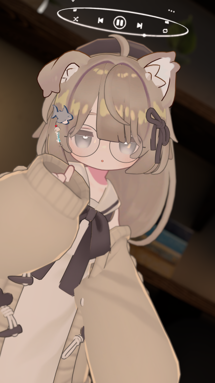
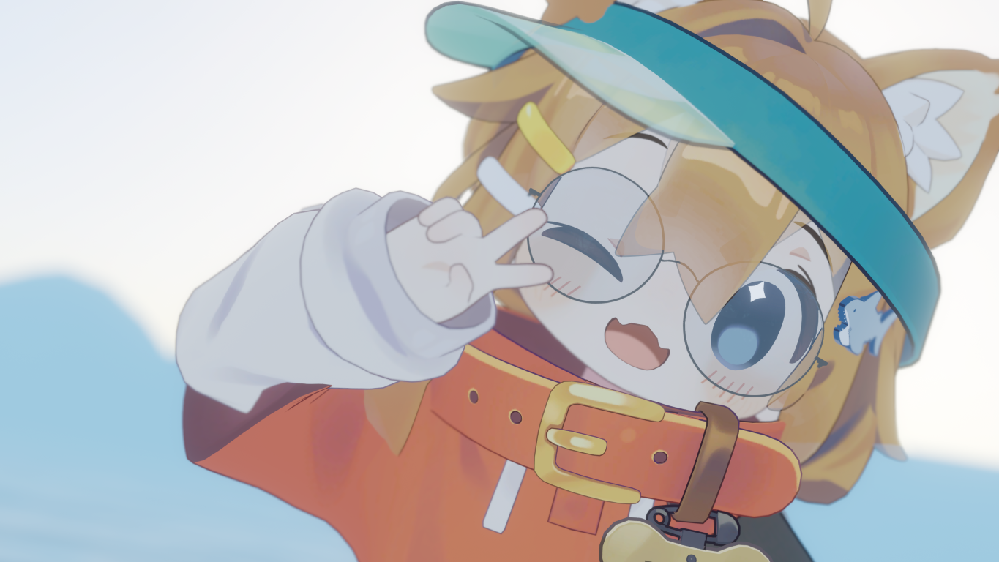
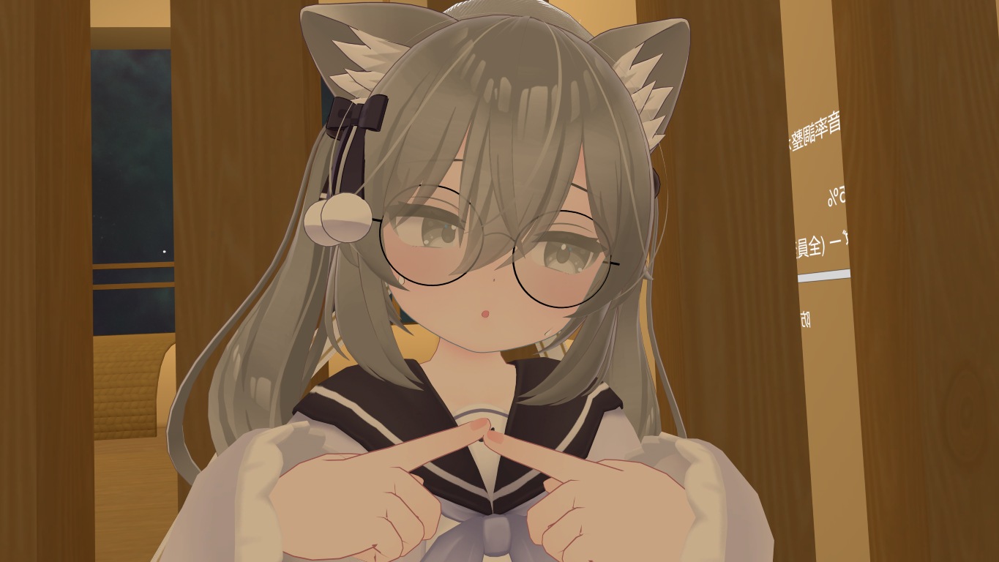
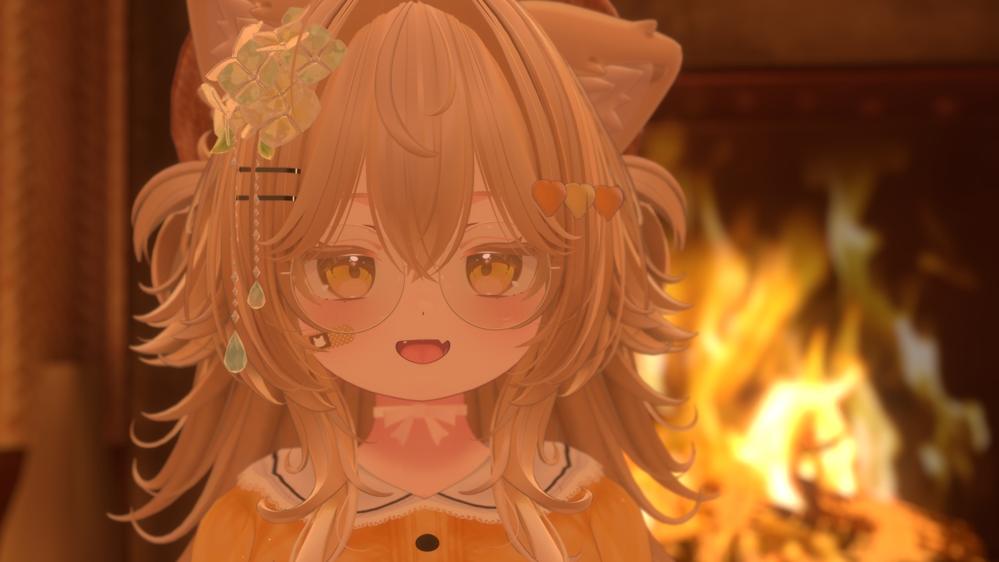
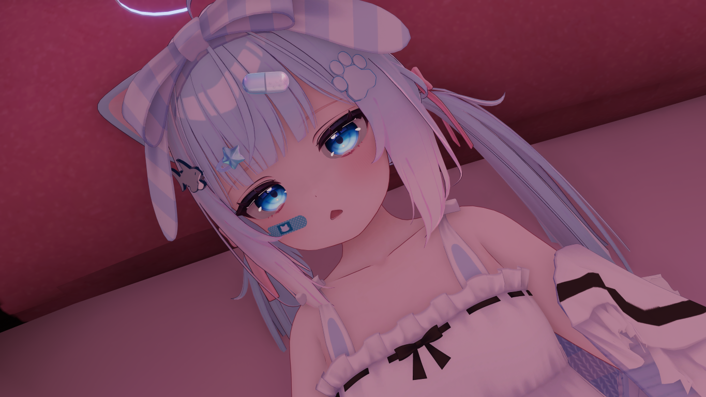

# 自分の使っているアバターの改変について

私がよくVRChatで使っているアバターの使っているアセット、デフォルトとちょっと変わってる部分などについて紹介します！

# まず、使っているアバターについて

私はVRChat内では、

- **キプフェル**

- **まめひなた**

- **ミルク**

- **ショコラ**

- **シフォン**

この5つのアバターをよく使っています。

それぞれ違った感じの改変になっているので、それぞれ説明していこうと思います。

# キプフェル

この子は、おそらく自分がVRChat内で一番よく使っているキプちゃんです！

## ベース

**アバター素体**: [キプフェル Kipfel / オリジナル3Dモデル - もち山金魚](https://booth.pm/ja/items/5813187)

## 衣装

**衣装**: [【キプフェル専用】 ♡ 𝐆𝐚𝐫𝐧𝐞𝐭 ♡ 【VRChat向け衣装+ヘアモデル】 - PINK♡PUDDING](https://booth.pm/ja/items/6588091)

## アクセサリー

**眼鏡**: [【VRchat】 Metal Frame Glasses [メタル素材丸眼鏡] - ranchino](https://booth.pm/ja/items/3750938)

**耳**: [まめひなた Mamehinata / オリジナル3Dモデル - もち山金魚](https://booth.pm/ja/items/4340548)

**ソーダアクセサリー**: [ひえひえソーダアクセサリー - kuroneko-koubou](https://booth.pm/ja/items/7361648)

**ゆるしゃーくヘアアクセ**: [ゆるっとシャーク🦈ヘアクリップ - かこい亭](https://booth.pm/ja/items/6026483)

**ヘイロー**: [music player halo - 虎の子](https://booth.pm/ja/items/7351885)

**アイテクスチャ**: [【キプフェル専用】すやすやEye - おちゃかなしょっぷ -Shop Ochakana- ](https://booth.pm/ja/items/5913410)

**表情セット**: [【無料版あり】キプフェルちゃん表情セット！46+10種 - n2qix](https://booth.pm/ja/items/6015218)

**髪型**: [【キプフェル専用】 ♡ 𝐆𝐚𝐫𝐧𝐞𝐭 ♡ 【VRChat向け衣装+ヘアモデル】 - PINK♡PUDDING](https://booth.pm/ja/items/6588091)

## ほかのキプちゃんと変わってるところ

- **Head**のスケールが、**1.00**ではなくて、**0.8**と、ちょっとだけ顔が小さくなってます！
>  髪のバランスとかを見ながら調整してたら、0.8がぴったりって感じました！

# まめひなた

たまに使うまめひなたです！！

ほとんど変わってないように見えますが、細かいところが結構変わってたりします！

## ベース

**アバター素体**: [まめひなた Mamehinata / オリジナル3Dモデル - もち山金魚](https://booth.pm/ja/items/4340548)

## テクスチャ

**髪の透明マスク**: [【無料/free】透け髪マスク【まめひなた】 - Atelier Tsubasa バサ工房](https://booth.pm/ja/items/6525877)

## アクセサリー

**眼鏡**: [【VRchat】 Metal Frame Glasses [メタル素材丸眼鏡] - ranchino](https://booth.pm/ja/items/3750938)

**ゆるしゃーくヘアアクセサリー**: [ゆるっとシャーク🦈ヘアクリップ - かこい亭](https://booth.pm/ja/items/6026483)

## ほかのまめひなたと変わってるところ

- デフォルト表情を、ちょっと元気な子っぽく微調整したりしてます！

- 髪の色を、デフォルトベースでグラデーションマップを使って再生成してます！

> Color Changer For UnityのバランスモードV3を使って作ってます！

- デフォ服のコントラストが上がってます！！

> 少しだけ明るい印象を与えるために、コントラストを上げてちょっとだけ明るくしてます！

# ミルク

最近よく使ってるミルクちゃんです！

## ベース

**アバター素体**: [ミルク Re -Milk Re-【オリジナル3Dモデル】 - あまとうさぎ](https://booth.pm/ja/items/2953391)

## 衣装

**衣装**: [【ラスクちゃん・ミルクちゃん対応】衣装モデル『和セーラー』 - ほむぺじ](https://booth.pm/ja/items/3828477)

## アクセサリー

**眼鏡**: [【VRchat】 Metal Frame Glasses [メタル素材丸眼鏡] - ranchino](https://booth.pm/ja/items/3750938)

**髪型**: [カリン -Karin-【オリジナル3Dモデル】 - あまとうさぎ](https://booth.pm/ja/items/3470989)

**帽子**: [《37アバター対応衣装》ステラ・ルミエール - 白猫通りのナギ亭](https://booth.pm/ja/items/6237445)

**表情**: [【無料】じとゆる表情セット【ミルクちゃん対応】 - みとりえ](https://booth.pm/ja/items/5096794)

## ほかのミルクちゃんと変わってるところ

- デフォルトのアイテクスチャの色が変わってます！

> **TexTransTool**の**PSD Importer**と**Color Changer For Unity**を組み合わせて、Eyeレイヤーだけクリッピングして色改変してます！
> 
> **デフォアイテクスチャは良いぞ！！！**

# ショコラ

よく私のイベントで使っているショコラちゃんです！たまに出てきます！

## ベース

**アバター素体**: [ショコラ -Chocolat-【オリジナル3Dモデル】 - あまとうさぎ](https://booth.pm/ja/items/6405390)

## 衣装

**衣装**: [《41アバター対応衣装》ベルチェックワンピース - 白猫通りのナギ亭](https://booth.pm/ja/items/6750939)

## アクセサリー

**眼鏡**: [【VRchat】 Metal Frame Glasses [メタル素材丸眼鏡] - ranchino](https://booth.pm/ja/items/3750938)

**パンダアクセサリー**: [🐼Panda Accessories🐼【MA対応】#arupaka_VRC - arupaka](https://booth.pm/ja/items/6680176)

**紫陽花アクセサリー**: [【PB対応】きらきら紫陽花の花飾り 3タイプ×3色セット🌼 - おもちやさん](https://booth.pm/ja/items/3050625)

**首輪（今はないかも！）**: [【VRC想定衣装】「ArtemisSailor」アルテミス・セーラー　（複数アバター対応） - SilverSpace](https://booth.pm/ja/items/4222837)

**髪型:** [Lynn Hair <40アバター対応> - mochipun](https://booth.pm/ja/items/6690701)

**アイテクスチャ**: [【14アバター対応】Sparkling eyesテクスチャ ♥15color♥ - さばさばショップ](https://booth.pm/ja/items/6433694)

**顔の絆創膏**: [にゃんこ ばんそうこう（Cat Bandage） - こけっこぴよぴよ](https://booth.pm/ja/items/4137208)

**表情**: 次に紹介するシフォンちゃんベースで全て自作だったはずです！

## ほかのショコラちゃんと変わってるところ

- 顔のシェイプキーがめっちゃ変わってます！

> **丸っこく、可愛い感じ**にしてます！

- 色改変をすべて**VRC Color Changer**で行って、全体の雰囲気を合わせるようにしてます！

> たしか、初めて**VRC Color Changer**を本格的に使って改変したアバターだった気がします！

## 裏話

この子、自分が絶対使わないような**黄色、オレンジっぽい**色合いになっていると思うんですが。

これ、「**いつもと違う改変してみたらどうなるんだろう？**」って思って、思いっきり変えてみたら思いの外うまく行ってしまって、お気に入りになった子だったりします。

# シフォン

私がずっと長い間使っていたシフォンちゃんです！

最近リメイクしました（VirtualLensとか入れ直したかったので...）

## ベース

**アバター素体**: [シフォン -Chiffon-【オリジナル3Dモデル】 - あまとうさぎ](https://booth.pm/ja/items/5354471)

## 衣装

**メイン衣装**: [【39アバター対応】ねこてんしこーで - かぷちやのぶーす](https://booth.pm/ja/items/6007189)

**よく使う衣装(写真のはこの衣装)**: [【52アバター対応】Re:うさぎさんるーむうぇあ - かぷちやのぶーす](https://booth.pm/ja/items/5657072)

## アクセサリー

**ヘイロー**: [【無料】フォロワー2000人記念　エクリプスヘイロー - ぽた屋](https://booth.pm/ja/items/5854580)

**顔の絆創膏**: [にゃんこ ばんそうこう（Cat Bandage） - こけっこぴよぴよ](https://booth.pm/ja/items/4137208)

**ヘアアクセサリー**: [☁Fefe's Hair Accessories☁ - felicitafelice](https://booth.pm/ja/items/4666852)

**パンダアクセサリー（ねこてんシフォン）**: [🐼Panda Accessories🐼【MA対応】#arupaka_VRC - arupaka](https://booth.pm/ja/items/6680176)

**雲ヘアピン（URWシフォン）**: [【VRC想定･MA対応】雲ヘアピン Cloud Hair Accessory【アクセサリー】 - ham.am / はむあむ](https://booth.pm/ja/items/5410436)

**ゆるしゃーくヘアアクセサリー**: [ゆるっとシャーク🦈ヘアクリップ - かこい亭](https://booth.pm/ja/items/6026483)

**表情**: **デフォルトベース** + [💗【FREE/無料】Chiffon100Type❥動くまばたFace&PoseAnimations ⌖ ݁˚ - 𝐒𝐀𝐋𝐄 ❥∔ShapeshifterClinic∔](https://booth.pm/ja/items/5594654)

**アイテクスチャ**: [【あまとうさぎ4アバター専用】Ciel アイテクスチャ【全9色】 - meiのshop❣ (仮)](https://booth.pm/ja/items/6123293)

## ほかのシフォンちゃんと変わってるところ

- 顎のところだけ、ちょっと丸くしてます！

> 丸っこい印象が出てかわいいよね...

# おわり！！

これで、最近よく使うアバター改変については説明し終えたと思います！（もしかしたら忘れてる部分もあるかもしれませんが....）

自分の改変、自分で結構気に入ってるので、ぜひ参考にしてみてください！！！

色改変は全て

- [【無料】テクスチャ改変用の色変更ツール / VRC Color Changer - ぷこるふの倉庫](https://pukorufu.booth.pm/items/6519471)

- [【無料】非破壊の色改変ツール / Color Changer For Unity - ぷこるふの倉庫](https://pukorufu.booth.pm/items/7315019)

- [TexTransTool【UnityEditor拡張】 - ReinaS'Shop](https://booth.pm/ja/items/4833984)

これらを使って行われています！！

改変時のアセット管理には

[【無料】アバター改変用のエクスプローラー / VRC Avatar Explorer - ぷこるふの倉庫](https://pukorufu.booth.pm/items/6372968)

このツールを使っています！！ぜひ一度使ってみてください！！！
