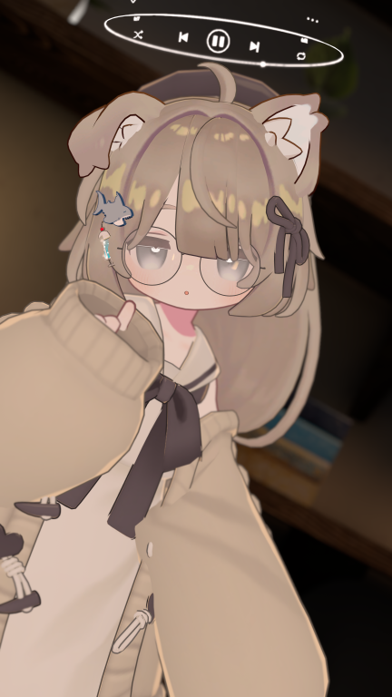
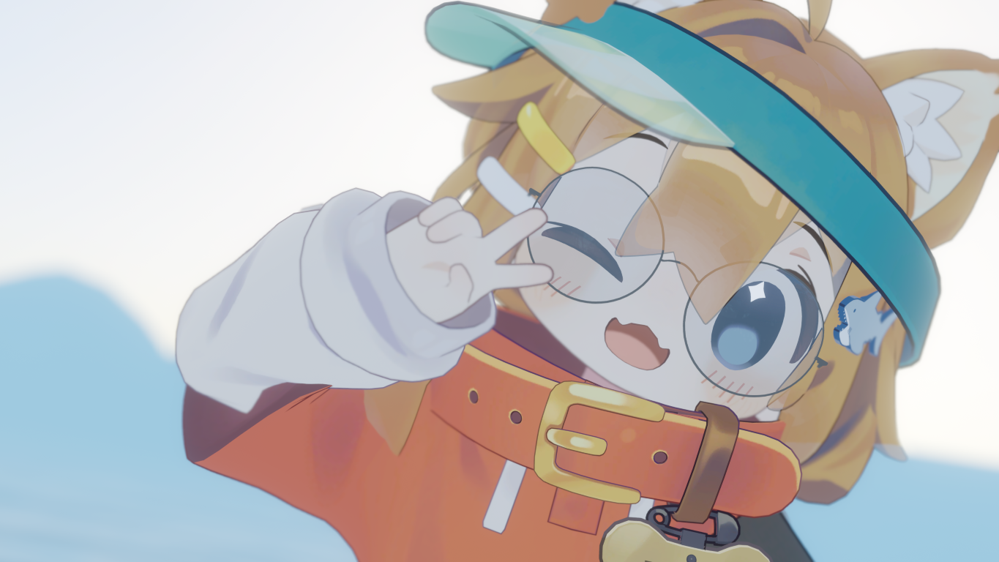
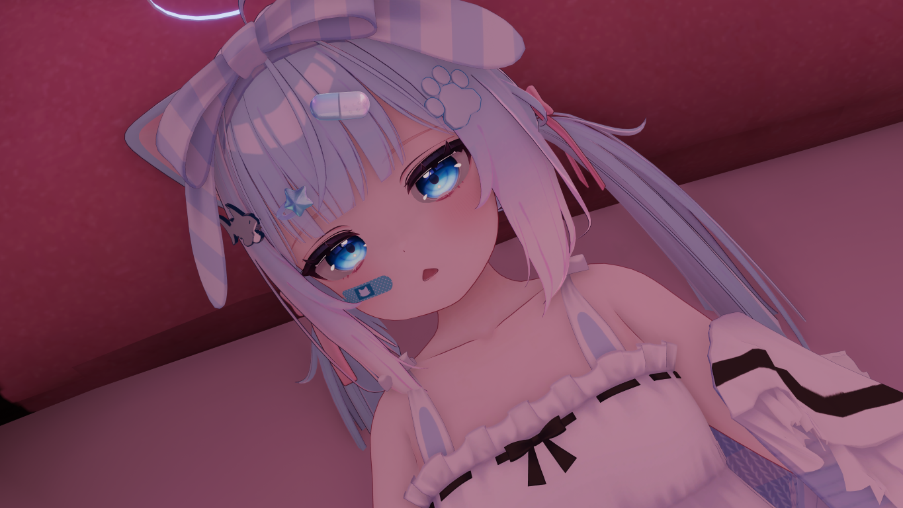
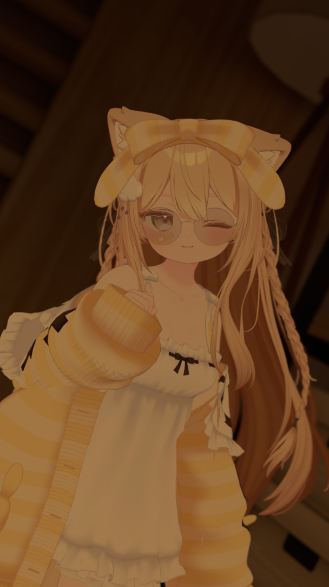
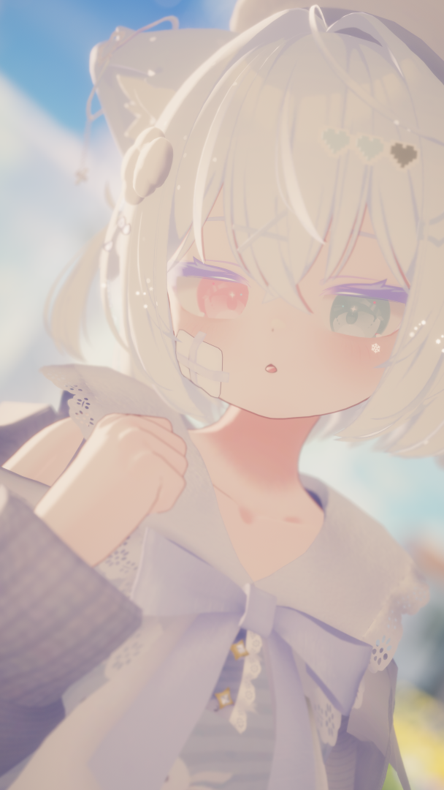
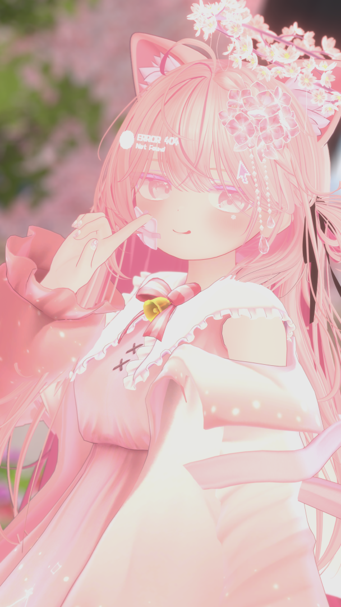
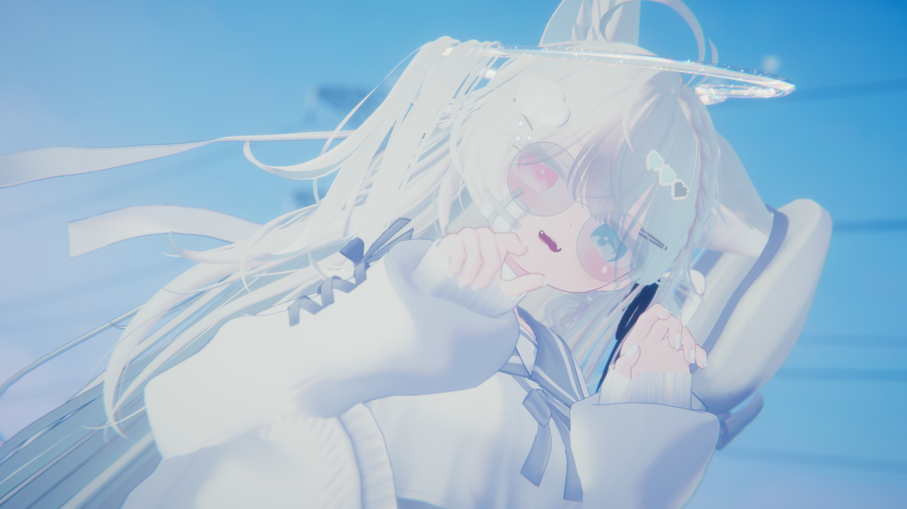

# 自分が改変して使っているアバターとアセット一覧

この記事では、私がVRChatでよく使っているアバターの改変に使用したアセットをまとめています！気になるアセットがあればぜひ参考にしてみてください！

## 目次

- [使っているアバター一覧](#使っているアバター一覧)
- [キプフェル](#キプフェル)
- [まめひなた](#まめひなた)
- [シフォン](#シフォン)
- [プラム](#プラム)
- [ショコラ](#ショコラ)
- [桜シフォン](#桜シフォン)
- [白プラム](#白プラム)
- [使用しているメッシュ微調整ツール](#使用しているメッシュ微調整ツール)
- [使用している色改変ツールなど](#使用している色改変ツールなど)

## 使っているアバター一覧

- キプフェル
- まめひなた
- プラム
- ショコラ
- シフォン

---

### キプフェル

- **素体**: [キプフェル Kipfel / オリジナル3Dモデル - もち山金魚](https://mukumi.booth.pm/items/5813187)
- **衣装**: [ ♡ 𝐆𝐚𝐫𝐧𝐞𝐭 ♡  - PINK♡PUDDING](https://pinkpudding.booth.pm/items/6588091)

**アクセサリー（よく使うもの）**

- 眼鏡: [Metal Frame Glasses [メタル素材丸眼鏡] - ranchino](https://ranchino.booth.pm/items/3750938)
- 耳: [まめひなた Mamehinata / オリジナル3Dモデル - もち山金魚](https://mukumi.booth.pm/items/4340548)
- ソーダアクセサリー: [ひえひえソーダアクセサリー - kuroneko-koubou](https://kuroneko-koubou.booth.pm/items/7361648)
- ヘアアクセサリー: [ゆるっとシャーク🦈ヘアクリップ - かこい亭](https://kakoi-s.booth.pm/items/6026483)
- ヘイロー: [music player halo - 虎の子](https://10ra023.booth.pm/items/7351885)
- アイテクスチャ: [すやすやEye - おちゃかなしょっぷ -Shop Ochakana- ](https://escapefroma.booth.pm/items/5913410)
- 表情セット: [キプフェルちゃん表情セット！46+10種 - n2qix](https://n2qix.booth.pm/items/6015218)

**改変メモ**

- Headのスケールを1.00→0.8にして、顔を少し小さめにしています。

---

### まめひなた

- **素体**: [まめひなた Mamehinata / オリジナル3Dモデル - もち山金魚](https://mukumi.booth.pm/items/4340548)

**テクスチャ**

- 髪の透明マスク: [透け髪マスク - Atelier Tsubasa バサ工房](https://atelier-tsubasa.booth.pm/items/6525877)

**アクセサリー**

- 眼鏡: [【VRchat】 Metal Frame Glasses [メタル素材丸眼鏡] - ranchino](https://ranchino.booth.pm/items/3750938)
- ヘアアクセサリー: [ゆるっとシャーク🦈ヘアクリップ - かこい亭](https://kakoi-s.booth.pm/items/6026483)

**改変メモ**

- 髪色をデフォルトベースにグラデーションマップで作り直してます！（Color Changer For Unity のバランスモードV3を使用）
- デフォルトの服のコントラストを少し上げて、明るくしてます！

---

### シフォン

- **素体**: [シフォン -Chiffon- - あまとうさぎ](https://komado.booth.pm/items/5354471)

**衣装**

- メイン衣装: [ねこてんしこーで - かぷちやのぶーす](https://capettiya.booth.pm/items/6007189)
- よく使う衣装: [Re:うさぎさんるーむうぇあ - かぷちやのぶーす](https://capettiya.booth.pm/items/5657072)

**アクセサリー**

- ヘイロー: [フォロワー2000人記念　エクリプスヘイロー - ぽた屋](https://pokotaaa.booth.pm/items/5854580)
- 顔の絆創膏: [にゃんこ ばんそうこう（Cat Bandage） - こけっこぴよぴよ](https://tosakahiyoshi.booth.pm/items/4137208)
- ヘアアクセサリー: [☁Fefe's Hair Accessories☁ - felicitafelice](https://felicitafelice.booth.pm/items/4666852)
- パンダアクセ（ねこてんシフォン）: [🐼Panda Accessories🐼【MA対応】#arupaka_VRC - arupaka](https://arupaka001.booth.pm/items/6680176)
- 雲ヘアピン: [雲ヘアピン Cloud Hair Accessory - ham.am / はむあむ](https://ham-am.booth.pm/items/5410436)
- 表情: デフォルトベース + [シフォンChiffon100Type❥FaceAnimation表情パッケージ.𖥔⌖݁˚ - ShapeshifterClinic](https://shapeshiftercl.booth.pm/items/5594654)
- アイテクスチャ: [Ciel アイテクスチャ - meiのshop❣ (仮)](https://mei18.booth.pm/items/6123293)

---

### プラム

- **素体**: [プラム -Plum- - あまとうさぎ](https://komado.booth.pm/items/7770415)
- **衣装**: [Re:うさぎさんるーむうぇあ - かぷちやのぶーす](https://capettiya.booth.pm/items/5657072)

**アクセサリー**

- 眼鏡: [Metal Frame Glasses - ranchino](https://ranchino.booth.pm/items/3750938)
- 雲ヘアピン: [雲ヘアピン Cloud Hair Accessory - ham.am / はむあむ](https://ham-am.booth.pm/items/5410436)
- 耳: [ショコラ -Chocolat- - あまとうさぎ](https://komado.booth.pm/items/6405390)
- しっぽ: [シフォン -Chiffon- - あまとうさぎ](https://komado.booth.pm/items/5354471)

**髪型**

- 前髪: プラム素体付属
- 後ろ髪: [Lavender Braid Hair - 隣の店](https://tonarino8908.booth.pm/items/5483086)

---

### ショコラ

- **素体**: [ショコラ -Chocolat- - あまとうさぎ](https://komado.booth.pm/items/6405390)
- **衣装**: [シュガーワンピ - 餅亭](https://mochitei.booth.pm/items/5594480)

**アクセサリー**

- 雲ヘアピン: [雲ヘアピン Cloud Hair Accessory - ham.am / はむあむ](https://ham-am.booth.pm/items/5410436)
- ヘアアクセサリー(写真 | HPがMAX): [☁Fefe's Hair Accessories☁ - felicitafelice](https://felicitafelice.booth.pm/items/4666852)
- ヘアアクセサリー(HPが1減ってる): [動く！ PixelBoot ヘアアクセサリー (+なで警告ギミック) - ARCA-WORKS](https://arca-works.booth.pm/items/7081568)
- 耳ヘイロー: [キロ Kyro Neko Hoodie🐈︎ - くろねこ](https://shop-kuroneko.booth.pm/items/8243183)
- アイテクスチャ: [Sparkling eyesテクスチャ ♥15color♥ - さばさばショップ](https://sabavrc.booth.pm/items/6433694)
- ネイル: [HoroNail - 𝔸𝕟-𝕃𝕒𝕓𝕠.𝕍𝕚𝕣𝕥𝕦𝕒𝕝](https://van-labo.booth.pm/items/3407613)
- 目元パーティクル＆ボディシール: [Stardust Whispers - ARCA-WORKS](https://arca-works.booth.pm/items/6626299)
- ほっぺガーゼ: [プラム -Plum- - あまとうさぎ](https://komado.booth.pm/items/7770415)

**髪型**

- 写真: ショコラ素体
- 前髪: [ねこタイドボブヘア - Li-ne_Shop](https://li-ne.booth.pm/items/7977491)
- 後ろ髪: [ラブリーロングヘア - Li-ne_Shop](https://li-ne.booth.pm/items/7643173)

---

### 桜シフォン

- **素体**: [シフォン -Chiffon- - あまとうさぎ](https://komado.booth.pm/items/5354471)
- **衣装**: [ゆめいろワンピース - ほむぺじ](https://pii34.booth.pm/items/5222688)

**アクセサリー**

- アイテクスチャ: [Sparkling eyesテクスチャ ♥15color♥ - さばさばショップ](https://sabavrc.booth.pm/items/6433694)
- 桜ヘイロー: [Sakura Halo -宵桜の輪- - QuQu](https://sonovr.booth.pm/items/6751976)
- デジタルヘアアクセ: [デジタルヘアアクセ Digital Hair Accessories - ham.am / はむあむ](https://ham-am.booth.pm/items/5659402)
- ほっぺガーゼ: [プラム -Plum- - あまとうさぎ](https://komado.booth.pm/items/7770415)
- 紫陽花花飾り: [きらきら紫陽花の花飾り 3タイプ×3色セット🌼 - おもちやさん](https://omochi-mochishop.booth.pm/items/3050625)
- 目元ボディシール: [Stardust Whispers - ARCA-WORKS](https://arca-works.booth.pm/items/6626299)

**髪型**

- 前髪: [ねこタイドボブヘア - Li-ne_Shop](https://li-ne.booth.pm/items/7977491)
- 後ろ髪: [ラブリーロングヘア - Li-ne_Shop](https://li-ne.booth.pm/items/7643173)

---

### 白プラム

- **素体**: [プラム -Plum- - あまとうさぎ](https://komado.booth.pm/items/7770415)
- **衣装（写真）**: [カプチーノ学園 Summer - かぷちやのぶーす](https://capettiya.booth.pm/items/7323673)

**アクセサリー**

- アイテクスチャ: [Sparkling eyesテクスチャ ♥15color♥ - さばさばショップ](https://sabavrc.booth.pm/items/6433694)
- 眼鏡: [Metal Frame Glasses - ranchino](https://ranchino.booth.pm/items/3750938)
- 雲ヘアピン: [雲ヘアピン Cloud Hair Accessory - ham.am / はむあむ](https://ham-am.booth.pm/items/5410436)
- HPヘアアクセサリー: [動く！ PixelBoot ヘアアクセサリー (+なで警告ギミック) - ARCA-WORKS](https://arca-works.booth.pm/items/7081568)
- ネイル: [HoroNail - 𝔸𝕟-𝕃𝕒𝕓𝕠.𝕍𝕚𝕣𝕥𝕦𝕒𝕝](https://van-labo.booth.pm/items/3407613)
- ボディシール: [Stardust Whispers - ARCA-WORKS](https://arca-works.booth.pm/items/6626299)
- ほっぺガーゼ: [プラム -Plum- - あまとうさぎ](https://komado.booth.pm/items/7770415)
- イヤリング: [Seasonal Drop - ことしょっぷ](https://kotonaka1.booth.pm/items/6301947)
- 耳に掛けてる帽子: [シュガーワンピ - 餅亭](https://mochitei.booth.pm/items/5594480)

**髪型**

- 前髪: [ねこタイドボブヘア - Li-ne_Shop](https://li-ne.booth.pm/items/7977491)
- 後ろ髪: [ラブリーロングヘア - Li-ne_Shop](https://li-ne.booth.pm/items/7643173)
- 髪ヘイロー: [Halo Ring Hair - mochipun](https://mochipun.booth.pm/items/8457461)
- ヘイローマテリアル: [星空が揺れる！DreamLoopHalo ヘイロー - ARCA-WORKS](https://arca-works.booth.pm/items/7554950)

---

## 使用しているメッシュ微調整ツール

- [EreMorph - えれにゃんこどっとしょっぷ](https://erenoa.booth.pm/items/7552621)

## 使用している色改変ツール

- [テクスチャ改変用の色変更ツール / VRC Color Changer - ぷこるふの倉庫](https://pukorufu.booth.pm/items/6519471)
- [非破壊の色改変ツール / Color Changer For Unity - ぷこるふの倉庫](https://pukorufu.booth.pm/items/7315019)
- [非破壊のテクスチャ色改変・合成ツール / TexStackEditor - ぷこるふの倉庫](https://pukorufu.booth.pm/items/8026112)
- [TexTransTool - ReinaS'Shop](https://booth.pm/ja/items/4833984)

## アセット管理ツール

- [アバター改変用のエクスプローラー / VRC Avatar Explorer - ぷこるふの倉庫](https://pukorufu.booth.pm/items/6372968)

---
